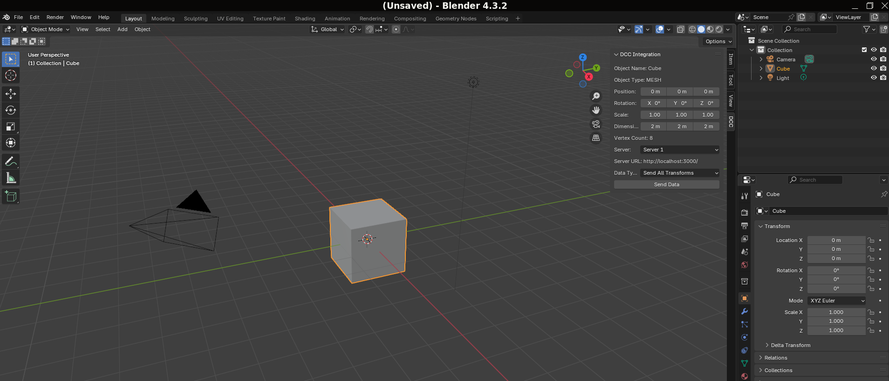
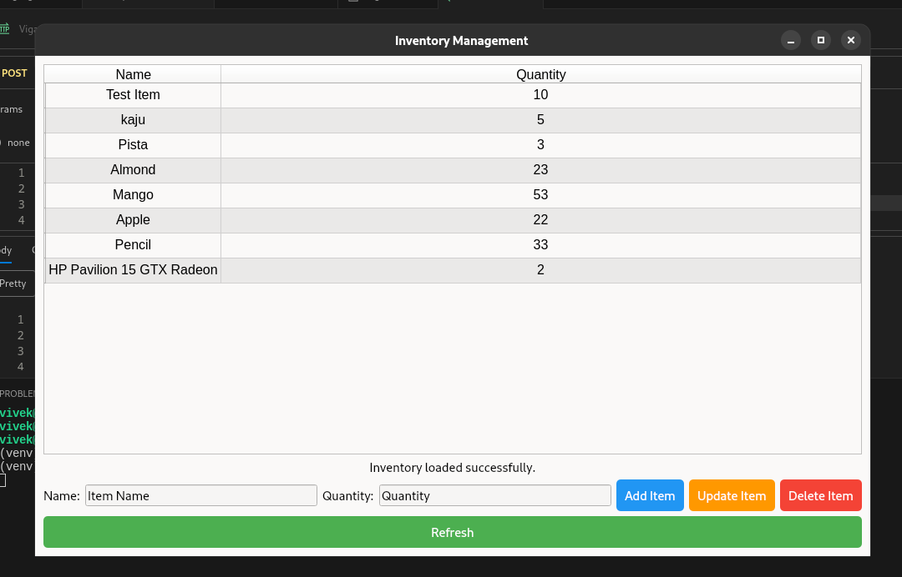

# DCC Integration Plugin and Server

This project integrates a Digital Content Creation (DCC) application (Blender) with a local server to manage object transforms and a simple inventory system. The project includes a Blender plugin, a Flask server, an SQLite database, and a PySide6 UI for inventory management.

## Table of Contents

- [Features](#features)
- [Installation](#installation)
- [Usage](#usage)
- [Images](#images)
- [Endpoints](#endpoints)
- [Database](#database)
- [UI](#ui)
- [Testing](#testing)
- [License](#license)

## Features

### DCC Plugin (Blender)
- Object selection and transform controls (position, rotation, scale).
- Endpoint dropdown to select server function.
- Submit button to send selected object's transform data to the server.

### Local Server (Flask)
- Endpoints to handle transforms, file paths, and inventory management.
- 10-second delay for all responses.
- Logs received requests to the terminal.
- Correct status codes (200, 400, 404).

### Database (SQLite)
- Stores items and quantities in an inventory.

### PySide6 UI
- Displays inventory from the database.
- Buttons to buy/return items, updating the database and the DCC plugin's display.
- Responsive UI that does not freeze while waiting for server responses.
- Single-binary packaging (Standlone Application : PyInstaller).

## Prerequisites
- Python 3.8+
- Blender 2.82+
- Virtual environment (recommended)

## Installation

1. Clone the repository:
    ```sh
    git clone https://github.com/konavivekramakrishna/VigaHack.git
    cd VigaHack
    ```

2. Create and activate a virtual environment:
    ```sh
    python -m venv venv
    source venv/bin/activate   # On Windows, use: venv\Scripts\activate
    ```

3. Install the required packages:
    ```sh
    pip install -r requirements.txt
    ```

4. Set up the SQLite database:
    ```sh
    python -m server.database
    ```

## Usage

### Running the Server
1. Navigate to the `server` directory:
    ```sh
    cd server
    ```

2. Run the Flask server:
    ```sh
    flask run
    ```

### Using the Blender Plugin
1. Open Blender.
2. Install the plugin from Edit -> Preferences -> Addon -> Install From Disk > `plugin.py`.
3. Use the plugin panel to select objects, adjust transforms, and send data to the server.

### Running the PySide6 UI
1. Navigate to the `frontend` directory:
    ```sh
    cd frontend
    ```

2. Run the inventory UI:
    ```sh
    python inventory_ui.py
    ```

## Images



## Endpoints

- `POST /transform`: Takes all transforms (position, rotation, scale).
- `POST /translation`: Takes only position.
- `POST /rotation`: Takes only rotation.
- `POST /scale`: Takes only scale.
- `POST /add-item`: Adds an item to the database (name, quantity).
- `DELETE /remove-item`: Removes an item from the database (by name).
- `PUT /update-quantity`: Updates an item's quantity (name, new quantity).

## Database

The project uses SQLite to store inventory items and their quantities. The database is set up automatically by running the `python -m server.database` command.

## UI

The PySide6 UI displays the inventory and allows users to perform CRUD operations on items. It communicates with the Flask server to update the database and refresh the display.

## Testing

The project includes unit tests for the server endpoints. To run the tests:

1. Start the server:
    ```sh
    flask run
    ```

2. Run the tests with pytest:
    ```sh
    pytest
    ```

## License

This project is licensed under the MIT License. See the [LICENSE](./LICENSE) file for details.
